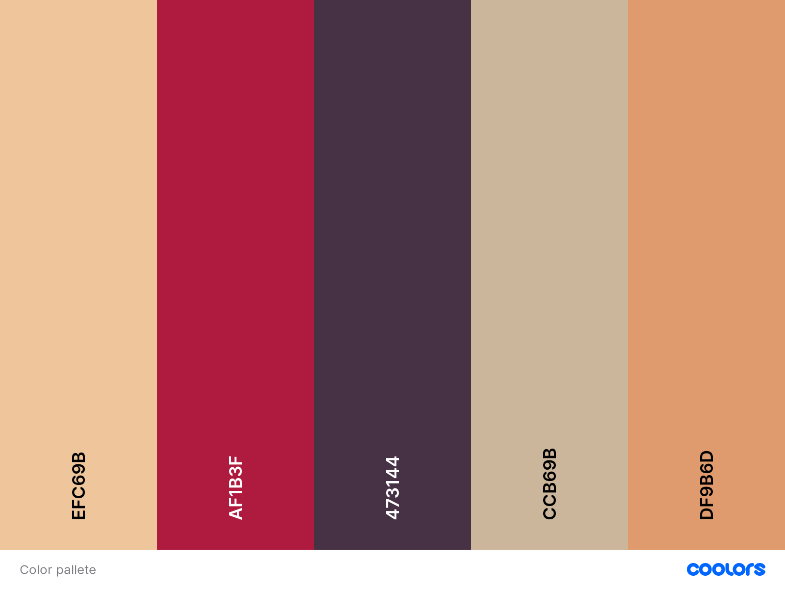
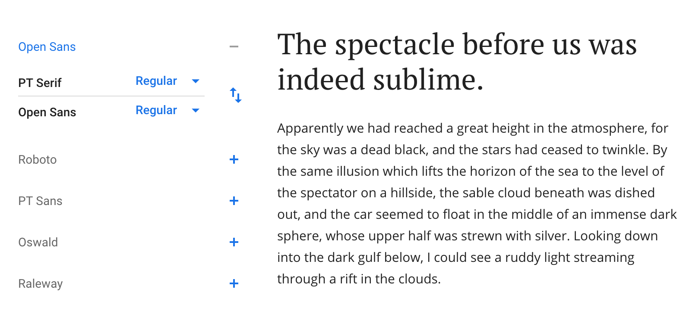

<div align="center">

# Blog post exploration

Blog post design exploration

[**Show your support by giving a ⭐**](https://github.com/krzysztofzuraw/blog-post-exploration/stargazers)

<br/><hr/>

</div>

## Installation

```sh
npm install
```

## Starting development server

```sh
npm start
```

## Inspiration

- https://www.awwwards.com/sites/think-global-health
- https://www.ben-evans.com/benedictevans/2020/4/13/covid-and-forced-experiments
- https://alistapart.com/article/cross-cultural-design/
- https://sarahdrasnerdesign.com/projects/
- https://www.taniarascia.com/writing-an-emulator-in-javascript-chip8/
- https://www.valentinog.com/blog/switch/
- https://ahmadawais.com/vercel/
- https://upmostly.com/tutorials/build-a-react-switch-toggle-component
- https://tympanus.net/Development/ArticleIntroEffects/index.html
- https://github.com/wesbos/css-grid/tree/master/25%20-%20Full%20Bleed%20Blog%20Layout
- https://webanimationworkshops.com/

## Process

### Working with idea

Prototype [here](/design/idea.pdf)

### Creating layout

Layout in [figma](https://www.figma.com/file/9098Lmle6njrx5enECtbn2/blog-post-exploration?node-id=0%3A1&viewport=854%2C266%2C0.30483871698379517)

### Picking pieces of design

- [color palette](https://coolors.co/efc69b-af1b3f-473144-ccb69b-df9b6d)



- [fonts](https://fonts.google.com/specimen/PT+Serif?category=Serif,Sans+Serif,Display&sidebar.open&preview.text=Pchn%C4%85%C4%87+w+t%C4%99+%C5%82%C3%B3d%C5%BA+je%C5%BCa+lub+o%C5%9Bm+skrzy%C5%84+fig&preview.text_type=custom&selection.family=Open+Sans|PT+Serif&query=open+sans)



- content from [wikipedia](https://en.wikipedia.org/wiki/Chemex_Coffeemaker)

- images from [unsplash](https://unsplash.com/s/photos/chemex)

- logo - my picture & from [noun project](https://thenounproject.com/)

## Contributing and Issues

Please feel free to contribute or file issues 🎉
